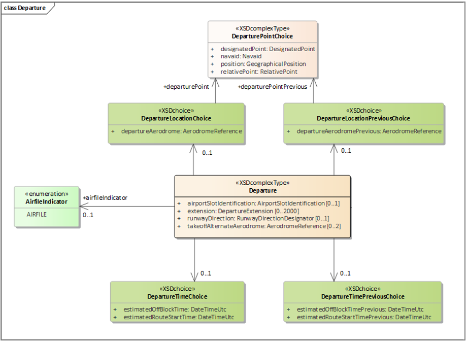

# Non-Aerodrome Departures

There are three use cases associated with departure points that can be represented in FIXM:
 
    1.	Flights that depart from aerodromes.
    2.	Flights that file non-aerodrome departure points.
    3.	Flights that file a flight plan that begins at an en route point (a so called airfile or AFIL flight).

The first of these is by far the most common use case, and while the second two cases are infrequent, 
they are required. 

Per the PANSATM, see the final clause of the DEP/ indicator under the Field Type 18 
section of Appendix 3 for the specific need to provide representation for a non-aerodrome departure point:  

“The first point of the route (name or LAT/LONG) or the marker radio beacon, if the aircraft has not taken 
off from an aerodrome.”

Further, the departure aerodrome/point represents a key field for traditional flight matching.

## FIXM representation

For most flights, i.e., flights departing from aerodromes, the current departure aerodrome and previous departure aerodrome (if a change has been made) will be represented in `departureAerodrome` and `departureAerodromePrevious` respectively. Likewise, the current and previous estimated off block times will be represented in `estimatedOffBlockTime` and `estimatedOffBlockTimePrevious`.

Flights that file non-aerodrome departure points will represent the current and previous departure points in `departurePoint` and `departurePointPrevious` respectively, and will use `estimatedOffBlockTime` and `estimatedOffBlockTimePrevious` for the current and previous estimated off block times.

Air file flights will represent the current and previous route start points in `departurePoint` and `departurePointPrevious` respectively, and will use `estimatedRouteStartTime` and `estimatedRouteStartTimePrevious` for the the current and previous route start times. In addition, air file flights will set the `airFileIndicator` to `"AIRFILE"`.

### Logical Model

The figure below illustrates how both common aerodrome and non-aerodrome departures are represented in FIXM.<sup><a href="#general-guidance/non-aerodrome-departures?id=notes">[note 1]</a></sup>



UML Class `Departure` in package `FIXM.Flight.Departure`

### XML schema

```xml
<xs:complexType name="DepartureType">
    <xs:annotation>
        <xs:documentation>Groups information pertaining to the flight's departure.</xs:documentation>
    </xs:annotation>
    <xs:sequence>
        ...
        <xs:element name="airfileIndicator" type="fx:AirfileIndicatorType" minOccurs="0" maxOccurs="1" nillable="true">
        </xs:element>
        ...
        <xs:choice minOccurs="0" maxOccurs="1">
            <xs:element name="departureAerodrome" type="fb:AerodromeReferenceType" minOccurs="1" maxOccurs="1" nillable="true">
            </xs:element>
            <xs:element name="departurePoint" type="fx:DeparturePointChoiceType" minOccurs="1" maxOccurs="1" nillable="true">
            </xs:element>
        </xs:choice>
        <xs:choice minOccurs="0" maxOccurs="1">
            <xs:element name="departureAerodromePrevious" type="fb:AerodromeReferenceType" minOccurs="1" maxOccurs="1" nillable="true">
            </xs:element>
            <xs:element name="departurePointPrevious" type="fx:DeparturePointChoiceType" minOccurs="1" maxOccurs="1" nillable="true">
            </xs:element>
        </xs:choice>
        <xs:choice minOccurs="0" maxOccurs="1">
            <xs:element name="estimatedOffBlockTime" type="fb:DateTimeUtcType" minOccurs="1" maxOccurs="1" nillable="true">
            </xs:element>
            <xs:element name="estimatedRouteStartTime" type="fb:DateTimeUtcType" minOccurs="1" maxOccurs="1" nillable="true">
            </xs:element>
        </xs:choice>
        <xs:choice minOccurs="0" maxOccurs="1">
            <xs:element name="estimatedOffBlockTimePrevious" type="fb:DateTimeUtcType" minOccurs="1" maxOccurs="1" nillable="true">
            </xs:element>
            <xs:element name="estimatedRouteStartTimePrevious" type="fb:DateTimeUtcType" minOccurs="1" maxOccurs="1" nillable="true">
            </xs:element>
        </xs:choice>
        ...
    </xs:sequence>
</xs:complexType>
```

[DepartureType][DepartureType] in file [Departure.xsd][Departure.xsd]

MORE EXPLANATORY TEXT HERE.

## Examples

### Example

```xml

<SCHEMA STUFF HERE>

```
[DepartureType]: https://www.fixm.aero/releases/FIXM-4.3.0/doc/schema_documentation/Fixm_DepartureType.html
[Departure.xsd]: https://www.fixm.aero/releases/FIXM-4.3.0/schemas/core/flight/departure/Departure.xsd


## Notes
[1]: To create the logical model, four new embedded choice classes using the <<XSDchoice>> stereotype were created named DepartureLocationChoice, DepartureLocationPreviousChoice, DepartureTimeChoice, and DepartureTimePreviousChoice all with the same definition:  “Helper class to create an embedded choice structure.” This approach was used to retain the explicit representation for the departure aerodrome as its own field with non-aerodrome departure points collected under a second field.

## References

[14]: [OGC 12-028r1](https://portal.opengeospatial.org/files/?artifact_id=62061): Use of Geography Markup Language (GML) for Aviation Data
