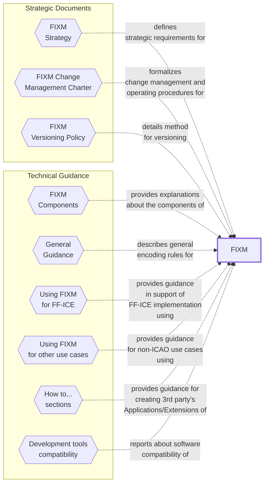

# Welcome to the FIXM User Manual

The `FIXM User Manual` is the online documentation of the FIXM project. Content has been subject to FIXM Change Control Board (CCB) review and endorsement and is therefore the official recommendation of the FIXM CCB.

This edition of the `FIXM User Manual` provides guidance for [FIXM Core 4.3.0], the [FF-ICE Application 1.1.0] and the [Basic Application 1.1.0].

Guidance for previous releases is available at the following links:
- [User Manual for FIXM 4.2.0 and related Applications]
- [Implementation Guidance for FIXM 4.1.0]

## Content Overview

The `FIXM User Manual` provides access to the **strategic documents** that guide the overall FIXM development, and captures **technical guidance** for the implementation of FIXM. The official FIXM components are available on the FIXM Website[[F-01]](#references). 

Note: The content of the FIXM User Manual is informative. The use of the words *shall* or *required* indicates a requirement to be strictly followed in order to conform to this guidance. The use of the words *should* or *recommended* indicates that there may may be valid reasons, in particular circumstances, to ignore a particular aspect of the guidance.

| Your FIXM use case | Chapters relevant to you |
|:-|:---|
| I want to use FIXM to implement ICAO FF-ICE Service(s) without local/regional arrangements | [FIXM COMPONENTS](general-guidance/fixm-components-introduction), [GENERAL GUIDANCE](general-guidance/introduction), [FIXM DEVELOPMENT TOOL COMPATIBILITY](fixm-development-tool-compatibility/introduction), [USING FIXM IN SUPPORT OF FF-ICE](fixm-in-support-of-ffice/ffice-application-for-fixm) |
| I want to use FIXM to implement ICAO FF-ICE Service(s) with local/regional arrangements | [FIXM COMPONENTS](general-guidance/fixm-components-introduction), [GENERAL GUIDANCE](general-guidance/introduction), [FIXM DEVELOPMENT TOOL COMPATIBILITY](fixm-development-tool-compatibility/introduction), [USING FIXM IN SUPPORT OF FF-ICE](fixm-in-support-of-ffice/ffice-application-for-fixm), [HOW TO CREATE A FIXM APPLICATION](how-to-create-application/initial-download-and-setup), [HOW TO CREATE A FIXM EXTENSION](how-to-create-fixm-extension/initial-download-and-setup), [HOW TO GENERATE XML SCHEMAS ...](how-to-generate-xml-schemas/generating-schemas-from-the-logical-model)|
| I want to use FIXM to exchange flight data based on my own organisation's needs | [FIXM COMPONENTS](general-guidance/fixm-components-introduction), [GENERAL GUIDANCE](general-guidance/introduction), [FIXM DEVELOPMENT TOOL COMPATIBILITY](fixm-development-tool-compatibility/introduction), [USING FIXM FOR OTHER USE CASES](fixm-for-other-use-cases/using-fixm-core-without-an-application), [HOW TO CREATE A FIXM APPLICATION](how-to-create-application/initial-download-and-setup), [HOW TO CREATE A FIXM EXTENSION](how-to-create-fixm-extension/initial-download-and-setup), [HOW TO GENERATE XML SCHEMAS ...](how-to-generate-xml-schemas/generating-schemas-from-the-logical-model) |

## Contribute

This sites aims to build a "community knowledge" about the implementation of FIXM. You can contribute to its evolution by submitting content and by supporting the technical exchanges of the FIXM Community using the FIXM Work Area.

- [SUBMIT CONTENT][SUBMIT CONTENT]
- [ACCESS THE FIXM WORK AREA][FIXM Work Area]

### How to get access to the FIXM Work Area

1.TODO

## How to use this web site

- Use the side bar opposite to access the various sections of the FIXM User Manual;
- Use the search engine to look for a specific entry;
- Use the buttons *< Previous* and *Next >* at the bottom of each page to navigate across the different sections of the manual.

## References

### FIXM references

[1]: [FIXM Strategy v1.1][FIXM Strategy v1.1]

[2]: [FIXM web site][FIXM.aero]

[3]: [FIXM Work Area][FIXM Work Area]

### ICAO references

[4]: PANS-ATM: Procedures for Air Navigation Services: Air Traffic Management, ICAO Doc 4444, 16th edition

[5]: [ICAO Doc 9965](http://www.icao.int/Meetings/anconf12/Documents/9965_cons_en.pdf): Manual on Flight and Flow Information for a Collaborative Environment

[6]: [ATMRPP/3-WP/766](https://eurocontrol.sharepoint.com/sites/coll-FIXM/Shared%20Documents/Forms/AllItems.aspx?id=%2Fsites%2Fcoll%2DFIXM%2FShared%20Documents%2FFIXM%20Change%20Requests%2FICAO%20ATMRPP%20inputs%20for%20FIXM%2FFF%2DICE%20Manual%20d0%2E99%5Fmarkup%2Epdf&parent=%2Fsites%2Fcoll%2DFIXM%2FShared%20Documents%2FFIXM%20Change%20Requests%2FICAO%20ATMRPP%20inputs%20for%20FIXM): “Manual on FF-ICE Implementation Guidance”

[7]: ICAO Doc 7910: Location Indicators

[8]: [ICAO Doc 8643](https://www.icao.int/publications/DOC8643/Pages/default.aspx): Aircraft Type Designators

[9]: PAN AIDC ICD: PAN Regional (NAT and APAC) Interface Control Document for ATC Interfacility Data Communications (PAN AIDC ICD), version 1.0

[10]: ICAO Doc 10039: Manual on System Wide Information Management (SWIM) Concept

[11]: ATMRPP-WG/24-WP/564: Flight Plan Filing Provisions for FF-ICE

### Other references

[12]: [Donlon AIP data Set](https://github.com/aixm/donlon): a fictitious set of digital AIS data sets complying with the ICAO Annex 15, 16th edition and the new PANS-AIM provisions, in AIXM 5.1.1 format.

[13]: [W3C XML Linking Language (xlink) v1.1](https://www.w3.org/TR/xlink11/)

[14]: [OGC 12-028r1](https://portal.opengeospatial.org/files/?artifact_id=62061): Use of Geography Markup Language (GML) for Aviation Data

## Acronyms

| **Acronym** |                                                                          |
|-------------|--------------------------------------------------------------------------|
| AIDC              | ATS Interfacility Data Communications |
| AIP               | Aeronautical Information Publication |
| AIRM              | ATM Information Reference Model |
| AIS               | Aeronautical Information Services |
| AIXM              | Aeronautical Information Exchange Model |
| AMDB              | Aerodrome Mapping Database |
| AMXM              | Aerodrome Mapping Exchange Model |
| ATM               | Air Traffic Management |
| ATMRPP            | ATM Requirements and Performance Panel |
| ATS               | Air Traffic Services |
| CCB               | Change Control Board |
| DME               | Distance measuring equipment |
| EAD               | European AIS Database |
| FF-ICE            | Flight and Flow Information for a Collaborative Environment |
| FF-ICE/R1         | FF-ICE Release 1 |
| FIXM              | Flight Information Exchange Model |
| FPL               | Filed Flight Plan |
| GML               | Geography Markup Language |
| GUFI              | Globally unique flight identifier |
| ICAO              | International Civil Aviation Organisation |
| IDE               | Integrated development environment |
| IFPS              | Integrated initial flight plan processing system |
| IFR               | Instrument flight rules |
| ISO               | International Organization for Standardization |
| JMS               | Java Message Service |
| MSL               | Mean sea level |
| NAS (US)          | (US) National Airspace System |
| Navaid            | Navigational aid |
| NDB               | Non-directional radio beacon |
| NM (EUROCONTROL)  | (EUROCONTROL) Network Manager |
| OGC               | Open Geospatial Consortium |
| PBN               | Performance-based navigation |
| REST              | Representational state transfer |
| SID               | Standard instrument departure |
| SOAP              | Simple Object Access Protocol |
| SSR               | Secondary surveillance radar |
| STAR              | Standard instrument arrival |
| SWIM              | System Wide Information Management |
| UML               | Unified Modeling Language |
| UPR               | User Preferred Route |
| URL               | Uniform Resource Locator |
| UTC               | Coordinated Universal Time |
| UUID              | Universally unique identifier |
| VFR               | Visual flight rules |
| VOR               | VHF omnidirectional radio range |
| W3C               | World Wide Web Consortium |
| WGS-84            | World Geodetic System - 1984 |
| WSDL              | Web Services Description Language |
| XML               | Extensible Markup Language |
| XSD               | XML Schema Definition |
| XSLT              | Extensible Stylesheet Language Transformations |

[FIXM Core 4.3.0]: https://fixm.aero/release.html?rel=FIXM-4.3.0&ret=core
[FF-ICE Application 1.1.0]: https://fixm.aero/release.html?rel=FFICE-Msg-1.1.0&ret=app
[Basic Application 1.1.0]: https://fixm.aero/release.html?rel=Basic-Msg-1.1.0&ret=app
[FIXM.aero]: https://www.fixm.aero
[FIXM Strategy v1.1]: https://fixm.aero/documents/FIXM%20Strategy.pdf

[FIXM Work Area]: https://eurocontrol.sharepoint.com/sites/coll-FIXM

[User Manual for FIXM 4.2.0 and related Applications]: https://fixm-ccb.github.io/FIXM-Core-4.2.0/#/
[Implementation Guidance for FIXM 4.1.0]: https://www.fixm.aero/documents/FIXM%20Implementation%20Guidance_FIXM%20v4.1.0.zip

[OneSky Online]: https://ext.eurocontrol.int/
[OneSky Teams]: https://ost.eurocontrol.int/Pages/default.aspx
[SUBMIT CONTENT]: https://fixm.aero/contact.pl?category=Technical&version=Other&versionOther=FIXM%20User%20Manual&details=Describe%20proposed%20content%20here
