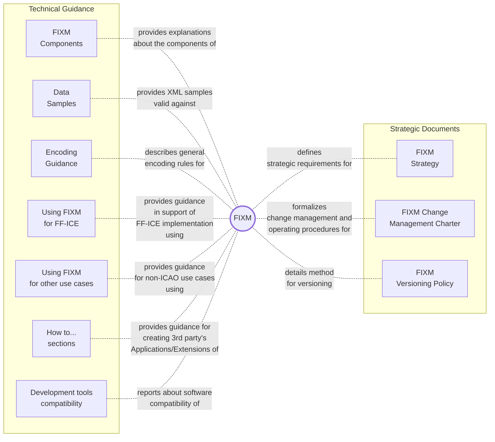

# Welcome to the FIXM User Manual

The `FIXM User Manual` is the online documentation of the FIXM project. Content has been subject to FIXM Change Control Board (CCB) review and endorsement and is therefore the official recommendation of the FIXM CCB.

This edition of the `FIXM User Manual` provides guidance for [FIXM Core 4.3.0], the [FF-ICE Application 1.1.0] and the [Basic Application 1.1.0].

Guidance for previous releases is available at the following links:
- [User Manual for FIXM 4.2.0 and related Applications]
- [Implementation Guidance for FIXM 4.1.0]

## Content Overview

The `FIXM User Manual` provides access to the **strategic documents** that guide the overall FIXM development, and captures **technical guidance** for the implementation of FIXM. The official FIXM components are available on the FIXM Website[[F-01]](#references). 

Note: The content of the FIXM User Manual is informative. The use of the words *shall* or *required* indicates a requirement to be strictly followed in order to conform to this guidance. The use of the words *should* or *recommended* indicates that there may may be valid reasons, in particular circumstances, to ignore a particular aspect of the guidance.

| Your FIXM use case | Chapters relevant to you |
|:-|:---|
| I want to use FIXM to implement ICAO FF-ICE Service(s) without local/regional arrangements | [FIXM COMPONENTS](general-guidance/fixm-components-introduction), [GENERAL GUIDANCE](general-guidance/fx_overview), [FIXM DEVELOPMENT TOOL COMPATIBILITY](fixm-development-tool-compatibility/introduction), [USING FIXM IN SUPPORT OF FF-ICE](fixm-in-support-of-ffice/ffice-application-for-fixm) |
| I want to use FIXM to implement ICAO FF-ICE Service(s) with local/regional arrangements | [FIXM COMPONENTS](general-guidance/fixm-components-introduction), [GENERAL GUIDANCE](general-guidance/fx_overview), [FIXM DEVELOPMENT TOOL COMPATIBILITY](fixm-development-tool-compatibility/introduction), [USING FIXM IN SUPPORT OF FF-ICE](fixm-in-support-of-ffice/ffice-application-for-fixm), [HOW TO CREATE A FIXM APPLICATION](how-to-create-application/introduction), [HOW TO CREATE A FIXM EXTENSION](how-to-create-fixm-extension/introduction), [HOW TO GENERATE XML SCHEMAS ...](how-to-generate-xml-schemas/introduction)|
| I want to use FIXM to exchange flight data based on my own organisation's needs | [FIXM COMPONENTS](general-guidance/fixm-components-introduction), [GENERAL GUIDANCE](general-guidance/fx_overview), [FIXM DEVELOPMENT TOOL COMPATIBILITY](fixm-development-tool-compatibility/introduction), [USING FIXM FOR OTHER USE CASES](fixm-for-other-use-cases/using-fixm-core-without-an-application), [HOW TO CREATE A FIXM APPLICATION](how-to-create-application/introduction), [HOW TO CREATE A FIXM EXTENSION](how-to-create-fixm-extension/introduction), [HOW TO GENERATE XML SCHEMAS ...](how-to-generate-xml-schemas/introduction) |

## Contribute

This sites aims to build a "community knowledge" about the implementation of FIXM. You can contribute to its evolution by submitting content and by supporting the technical exchanges of the FIXM Community using the FIXM Work Area.

- [SUBMIT CONTENT][SUBMIT CONTENT]
- [ACCESS THE FIXM WORK AREA][FIXM Work Area]

### How to get Access to the FIXM Work Area

First-time users should follow these [instructions](https://www.fixm.aero/content/accessing-the-fixm-work-area) to register for a free account.

## How to use this Web Site

- Use the side bar opposite to access the various sections of the FIXM User Manual;
- Use the search engine to look for a specific entry;
- Use the buttons *< Previous* and *Next >* at the bottom of each page to navigate across the different sections of the manual.

## References

### FIXM References

[F-01]: [FIXM Web Site](https://fixm.aero/)

[F-02]: [FIXM Strategy](strategic-docs/strategy.md)

[F-03]: [FIXM Change Management Charter](strategic-docs/charter.md)

[F-04]: [FIXM Work Area](https://eurocontrol.sharepoint.com/sites/coll-FIXM/)

### ICAO References

?> Access to some ICAO references listed below may require an [ICAO Portal](https://portallogin.icao.int/) account. Alternatively, you may get copies via the [ICAO Store](https://store.icao.int/).

[I-01]: [ICAO Doc 9854, 1st Edition, 2005](https://www.icao.int/Meetings/anconf12/Document%20Archive/9854_cons_en[1].pdf) - Global Air Traffic Management Operational Concept

[I-02]: [ICAO Doc 9882, 1st Edition, 2007](https://www.icao.int/airnavigation/IMP/Documents/Doc%209882%20-%20Manual%20on%20ATM%20Requirements.pdf) - Manual on Air Traffic Management System Requirements

[I-03]: [Global Air Navigation Plan](https://www4.icao.int/ganpportal/)

[I-04]: [ICAO Doc 4444, 16th Edition, 2016](https://portal.icao.int/icao-net/ICAO%20Documents/4444_cons_en.pdf) - PANS-ATM: Procedures for Air Navigation Services: Air Traffic Management

[I-05]: [ICAO Doc 9965, 2nd Edition, Volume I, v2022a (DRAFT)](https://portal.icao.int/atmrpp/ATMRPP5%20Montreal%2059%20June%202023/1_Working%20papers/ATMRPP5_WP1000_%20Appendix%20B%20Doc%209965%20Vol%20I%20Concept%20Document_v2022a%20_clean.pdf) - Manual on FF-ICE, Concept document **DRAFT** 

[I-06]: [ICAO Doc 9965, 2nd Edition, Volume II, v0.993 (DRAFT)](https://portal.icao.int/atmrpp/ATMRPP5%20Montreal%2059%20June%202023/1_Working%20papers/ATMRPP5_WP1000_Appendix%20C%20Doc%209965%20Vol%20II%20Implementation%20Guidance%20d0.993_markup.pdf) - Manual on FF-ICE, FF-ICE/R1 Implementation Guidance Manual **DRAFT** 

[I-07]: [ICAO Doc 7910](https://www.icao.int/safety/OPS/OPS-Tools/Pages/location-indicator.aspx) - Location Indicators

[I-08]: [ICAO Doc 8643](https://www.icao.int/publications/DOC8643/Pages/default.aspx) - Aircraft Type Designators

[I-09]: [PAN AIDC ICD, version 1.0](https://www.icao.int/APAC/Documents/edocs/PAN_ICD_AIDC_v1%200.pdf) - PAN Regional (NAT and APAC) Interface Control Document for ATC Interfacility Data Communications

[I-10]: [**DRAFT** ICAO Manual on System Wide Information Management (SWIM) Implementation, version September 2021](https://portal.icao.int/imp/MeetingDocs/IMP-2/Working%20Papers/Appendix%20A%20to%20IMP_2%20WP006%20%E2%80%93%20Manual%20on%20SWIM%20Implementation.pdf)

[I-11]: [ATMRPP/4-WP/922](https://portal.icao.int/atmrpp/Virtual%20ATMRPP4%201930%20April%202021/1_Working%20papers/ATMRPP4_WP_922_Updated%20FF-ICE%20R1%20Provisions_Appendix%20B_Clean.pdf) - Proposed Amendments to Annex 2, Doc 10066, and Doc 4444 concerning the initial implementation of FF-ICE Services

[I-12]: [ICAO Doc 9883, 1st Edition](https://portal.icao.int/icao-net/ICAO%20Documents/9883_cons_en.pdf) - Manual on Global Performance of the Air Navigation System

[I-13]: [ICAO Doc 9971, 3st Edition](https://portal.icao.int/icao-net/ICAO%20Documents/9971_cons_en.pdf) - Manual on Collaborative Air Traffic Flow Management]

[I-14]: ​[ICAO Aviation System Block Upgrades (ASBU) framework](https://www4.icao.int/ganpportal/ASBU?_gl=1*1k7ewhd*_ga*MTc2MDEwOTgyOS4xNjU4MzAxNzIy*_ga_992N3YDLBQ*MTY5MDc5MTQzNC4xNi4xLjE2OTA3OTM4NjIuMC4wLjA.)

[I-15]: [ICAO Doc 8585](https://www.icao.int/safety/OPS/OPS-Tools/Pages/3LD.aspx) - Designators for Aircraft Operating Agencies, Aeronautical Authorities and Services

[I-16]: [ICAO Doc 10150, 1st Edition, 2021](https://portal.icao.int/icao-net/ICAO%20Documents/10150_cons_en.PDF) - Manual on the Functional Specifications for the Location of an Aircraft in Distress Repository (LADR)

### Other References

[O-01]: [Donlon AIP data Set](https://github.com/aixm/donlon) - A fictitious set of digital AIS data sets complying with the ICAO Annex 15, 16th edition and the new PANS-AIM provisions, in AIXM 5.1.1 format.

[O-02]: [W3C XML Linking Language (xlink) v1.1](https://www.w3.org/TR/xlink11/)

[O-03]: [OGC 12-028r1](https://portal.opengeospatial.org/files/?artifact_id=62061) - Use of Geography Markup Language (GML) for Aviation Data

<!---[O-04]: Introduction to Aeronautical Information Exchange Model (AIXM) / Weather Information Exchange Model (WXXM) / FIXM Extensions, ICAO ATMRPP WP520-->

[O-05]: [ATM Information Reference Model](https://airm.aero/)

[O-06]: [EUROCONTROL Specification on SWIM Information Definition](https://www.eurocontrol.int/publication/eurocontrol-specification-swim-information-definition)

[O-07]: [IETF RFC 4122](https://datatracker.ietf.org/doc/html/rfc4122)

[O-08]: [ISO/IEC 9834-8:2014](https://www.iso.org/obp/ui#iso:std:iso-iec:9834:-8:ed-3:v1:en)

## Acronyms

| **Acronym** |                                                                          |
|-------------|--------------------------------------------------------------------------|
| ACID              | Aircraft Identification |
| AFTN              | Aeronautical Fixed Telecommunication Network |
| AIDC              | ATS Interfacility Data Communications |
| AIP               | Aeronautical Information Publication |
| AIRM              | ATM Information Reference Model |
| AIS               | Aeronautical Information Services |
| AIXM              | Aeronautical Information Exchange Model |
| AMDB              | Aerodrome Mapping Database |
| AMXM              | Aerodrome Mapping Exchange Model |
| ARINC             | Aeronautical Radio, Incorporated |
| ATC               | Air Traffic Control |
| ATM               | Air Traffic Management |
| ATMRPP            | ATM Requirements and Performance Panel |
| ATS               | Air Traffic Services |
| CCB               | Change Control Board |
| DME               | Distance measuring equipment |
| EA                | Enterprise Architect |
| EAD               | European AIS Database |
| EET               | Estimated Elapsed Time |
| EOBT              | Estimated Off-Block Time |
| FAA               | Federal Aviation Administration |
| FF-ICE            | Flight and Flow Information for a Collaborative Environment |
| FF-ICE/R1         | FF-ICE Release 1 |
| FIR               | Flight Information Region |
| FIXM              | Flight Information Exchange Model |
| FPL               | Filed Flight Plan |
| GML               | Geography Markup Language |
| GUFI              | Globally unique flight identifier |
| IAS               | Indicated Airspeed |
| IATA              | International Air Transport Association |
| ICAO              | International Civil Aviation Organisation |
| IDE               | Integrated development environment |
| IFPS              | Integrated initial flight plan processing system |
| IFR               | Instrument flight rules |
| ISO               | International Organization for Standardization |
| JMS               | Java Message Service |
| MSL               | Mean sea level |
| NAS (US)          | (US) National Airspace System |
| Navaid            | Navigational aid |
| NDB               | Non-directional radio beacon |
| NM (EUROCONTROL)  | (EUROCONTROL) Network Manager |
| OGC               | Open Geospatial Consortium |
| PANSATM           | Procedures for Air Navigation Services - Air Traffic Management |
| PBN               | Performance-based navigation |
| REST              | Representational state transfer |
| SID               | Standard instrument departure |
| SITA              | Société Internationale de Télécommunications Aéronautiques |
| SOAP              | Simple Object Access Protocol |
| SSR               | Secondary surveillance radar |
| STAR              | Standard instrument arrival |
| SWIM              | System Wide Information Management |
| UML               | Unified Modeling Language |
| UPR               | User Preferred Route |
| URL               | Uniform Resource Locator |
| UTC               | Coordinated Universal Time |
| UUID              | Universally unique identifier |
| VFR               | Visual flight rules |
| VOR               | VHF omnidirectional radio range |
| W3C               | World Wide Web Consortium |
| WGS-84            | World Geodetic System - 1984 |
| WSDL              | Web Services Description Language |
| XML               | Extensible Markup Language |
| XSD               | XML Schema Definition |
| XSLT              | Extensible Stylesheet Language Transformations |

[FIXM Core 4.3.0]: https://fixm.aero/release.html?rel=FIXM-4.3.0&ret=core
[FF-ICE Application 1.1.0]: https://fixm.aero/release.html?rel=FFICE-Msg-1.1.0&ret=app
[Basic Application 1.1.0]: https://fixm.aero/release.html?rel=Basic-Msg-1.1.0&ret=app
[FIXM.aero]: https://www.fixm.aero
[FIXM Strategy v1.1]: https://fixm.aero/documents/FIXM%20Strategy.pdf

[FIXM Work Area]: https://eurocontrol.sharepoint.com/sites/coll-FIXM

[User Manual for FIXM 4.2.0 and related Applications]: https://fixm-ccb.github.io/FIXM-Core-4.2.0/#/
[Implementation Guidance for FIXM 4.1.0]: https://www.fixm.aero/documents/FIXM%20Implementation%20Guidance_FIXM%20v4.1.0.zip

[SUBMIT CONTENT]: https://fixm.aero/contact.pl?category=Technical&version=Other&versionOther=FIXM%20User%20Manual&details=Describe%20proposed%20content%20here
