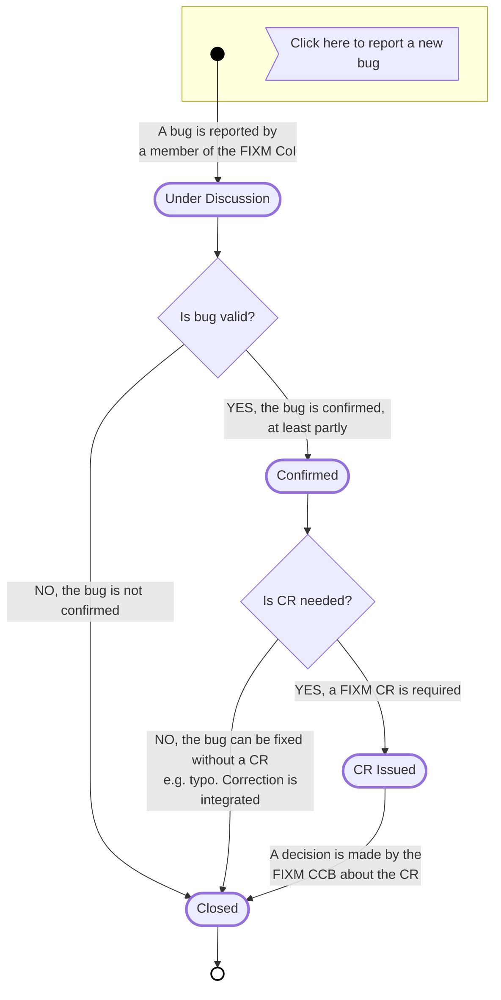
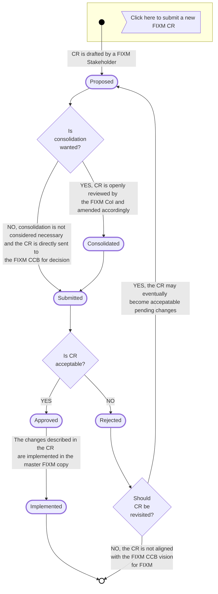

# FIXM Change Management Charter

This page formalizes the organization of the FIXM community and its operating procedures.

## Article 1 – Objective

1.1 The evolution of the Flight Information Exchange Model (FIXM) shall be managed in the interest of the largest number of `FIXM Stakeholders`, including the accommodation of necessary extensions.

1.2 A Change Control Board (`FIXM CCB`) with international participation is therefore established and will act under the provision of this Change Management Charter ("Charter"). The purpose of the `FIXM CCB` is to ensure that the strategic objectives for FIXM, described in the FIXM Strategy [[F-02]](#references), are satisfied.

1.3 The objective of this Charter is to support the information needs of the FIXM user community and of the larger aviation community through a disciplined, inclusive, and transparent approach to developing and approving new FIXM versions.

## Article 2 – The Change Control Board (`FIXM CCB`)

### FIXM CCB Roles & Scope

2.1 The `FIXM CCB` is the body that decides on the evolution of FIXM. This includes:
- a) The FIXM Strategy.
- b) The FIXM Change Management Charter (this document).
- c) The FIXM Release Plan.
- d) The FIXM components described in the FIXM Strategy [[F-02]](#references), chapter 2.2.
- e) Any communication materials about FIXM issued on behalf of the `FIXM Community`, including, but not limited to, Information Papers about FIXM for ICAO, materials supporting FIXM seminars and workshops etc.
- f) The content of the www.FIXM.aero web site [[F-01]](#references) that is globally applicable.

?> Note: www.FIXM.aero may contain additional pages capturing information relevant to individual stakeholder’s activities related to FIXM. Those pages will be clearly separated from the core part.

2.2 The `FIXM CCB`:
- a) Sets the main principles that will guide the FIXM development as described in the FIXM Strategy.
- b) Has overall responsibility for the evolution of FIXM to ensure alignment with the relevant ICAO requirements and consistency with the FIXM Strategy.
- c) Schedules the FIXM versions and manages the changes to be included in new versions.
- d) Endorses, or rejects, proposals for FIXM. Chapter 2.1 provides the detailed list of FIXM items subject to `FIXM CCB` endorsement.
- e) Considers proposals for inclusion in FIXM and decides whether elements are included in the FIXM core, in coordination with the `ICAO ATMRPP`.
- f) Maintains the catalogue of third-parties FIXM Applications and FIXM Extensions with the objectives of:
    - (i) Raising awareness about on-going FIXM related developments;
    - (ii) Reconciling, to the extent possible, the content of overlapping extensions and applications developed by different `FIXM Stakeholders` which would cover equivalent business needs;
    - (iii) Optimising the movement of data elements between FIXM core and extensions.
- g) Endorses, or rejects, proposals for physical representations of the FIXM Logical Model to be recognised for common use.
- h) Aims to ensure the transparency of change management for all Stakeholders.
- i) Provides `ICAO ATMRPP` with support for collecting candidate operational drivers for FIXM that would stem from `FIXM Stakeholders`.
- j) Arbitrates the integration of the different `FIXM Stakeholders`’ needs and views.
- k) If and when needed, prioritises FIXM Change Proposals and change activities.
- l) When needed, issues mapping guidelines on changes between versions - in particular when changes to the model result in major restructuring of concept elements.
- m) When needed, includes the release of formal conformance testing specifications, which enable an implementer to check and gain compliance with a FIXM version.
- n) Establishes and maintains relations with similar groups, or bodies, that are responsible for the other ATM information domain models (AIM, MET, etc.) and for the ATM Information Reference Model (AIRM).
- o) Reports regularly to `ICAO ATMRPP` on the progress of core developments and extensions, and consults on proposals for changes.
- p) Monitors the evolutions in the ATM domain in order to trigger appropriate changes to FIXM.

### FIXM CCB Membership

2.3 The `FIXM CCB` is composed of member organisations. The `FIXM CCB member organisations`, as set up under this charter, provide the change management necessary for FIXM to evolve.

2.4 Participation in the `FIXM CCB` is provided on a voluntary basis for the purpose of mutual, and wider, ATM benefit.

2.5 The rules for `FIXM CCB` membership are the following:
- a) The `FIXM CCB` is by default inclusive; this is necessary in so far as FIXM is aimed to be a global standard.
- b) Until the first FIXM version is released that fully realises FF-ICE/R1, `FIXM CCB` membership may be expanded only to new organisations that are in a position to provide direct sponsorship, including, but not limited to providing: resources to build the FIXM components over time; operational inputs to drive the FIXM development; and, improved synergies with relevant ATM communities of interest, particularly those identified in chapter 2.4 of the FIXM Strategy.
- c) Once the first FIXM version is released that fully realises FF-ICE/R1, `FIXM CCB` membership may be expanded, upon request, to any organisations that have a verifiable interest in the content and use of FIXM.

2.6 Each `FIXM CCB member organisation` is represented by an individual, playing the role of `FIXM CCB Member`. A `FIXM CCB Member` may be supported by technical advisers playing the role of `FIXM CCB Contributor`. The term `FIXM CCB Participants` collectively designates all the individuals playing the role of `FIXM CCB Member` or `FIXM CCB Contributor` within the `FIXM CCB`.

2.7 The list of `FIXM CCB member organisations` and corresponding `FIXM CCB Participants` is defined and maintained on the FIXM Work Area. A `FIXM CCB member organisation` can revisit the list of its `FIXM CCB Participants` at any time. For instance, a `FIXM CCB member organisation` can decide at any time to replace its `FIXM CCB Member`.

2.8 The `FIXM CCB` may include individuals playing the role of `Liaison` with other communities of interests or bodies identified in chapter 2.4 of the FIXM Strategy. A `Liaison` acts as observer within the `FIXM CCB` facilitating the coordination, but does not take part in the Decision Making Process for FIXM. Appointment of a `Liaison` is subject to `FIXM CCB` endorsement.

?> Note: an individual playing the role of `FIXM CCB Participant` may concurrently play a role of `Liaison`.

2.9 The `Liaisons` may include in particular an `AIRM Liaison` representing the `AIRM CCB` within the `FIXM CCB`. The `AIRM Liaison` communicates the AIRM work- and release plan to the `FIXM CCB`, informs the `FIXM CCB` about any AIRM-related work potentially relevant to FIXM, and coordinates with the `FIXM CCB` so that FIXM-related change proposals to the AIRM are acknowledged by the `FIXM CCB`, and subsequently informs the `AIRM CCB` thereof.

?> Note: The `AIRM liaison` is established following the planned Q4-2021 availability date of the draft PANS-IM provisions and in anticipation of the Q4-2024 applicability date of the expected PANS-IM provisions.

### Code of Conduct

2.10 `FIXM CCB Participants` agree to respect the following code of conduct when participating in the `FIXM CCB` and other FIXM activities:
- a) Behave courteously;
- b) Convey messages accurately, succinctly, and with specificity;
- c) Limit focus and discussions to topics relevant to FIXM;
- d) Ensure that contribution is based on the global community needs, not the needs of the member's organisation;
- e) Do not violate other members, or third parties, intellectual property rights.

2.11 No `FIXM CCB Participant` shall exert undue pressure in order to influence an outcome that has a bias to any one or more regions to the detriment of the objective of global interoperability.

2.12 A `FIXM CCB Participant` may be excluded for serious violation of the Charter. A proposal for exclusion must be brought forward by another `FIXM CCB Member` and will require consensus agreement of the remaining `FIXM CCB members` in order to take effect.

2.13 `FIXM CCB Members` are invited to inform the `FIXM CCB` about their plans for developing FIXM extensions and to share publicly these extensions using FIXM resources.

### Decision Making Process

2.14 `FIXM CCB Members` aim to actively support FIXM evolution activities and thus, `FIXM CCB Members` agree to participate in supporting the decision-making processes.

2.15 Decisions will be made during `FIXM CCB` meetings (see 2.21 & 2.22).

2.16 Decision making in the `FIXM CCB` will be by consensus in order to represent the best interests of the FIXM community through:
- a) Unanimity, if all `FIXM CCB Members` are present, spoken for, and in agreement;
- b) Unanimous consent by `FIXM CCB Members` who have spoken and silence by the others;
- c) Recording of a decision as a formal action with its associated due date. Lack of response by the due date is deemed concurrence.

?> Note: Consensus is defined as “group decision making process that seeks the consent, not necessarily the agreement of participants and the resolution of objections”

2.17 Objections shall be supported by clear arguments, in particular for business impacts, in order that other `FIXM CCB Members` may understand the objections and issues to be resolved. Current and immediate term operational reality should be considered as the prevailing arguments for the adoption of change proposals. Those that reflect future operational concepts will be subject to consideration of the operational needs and expectations, and may require further supporting evidence of concept agreement, or validation, for applicability at the international level. In such a case, the use of extensions as described in [1] should be considered as mitigation.

2.18 In the absence of consensus, the `FIXM CCB` will escalate the problem to the `ICAO ATMRPP` for resolution.

### FIXM CCB Procedures

2.19 The working language of `FIXM CCB` is (Oxford Dictionary) English.

2.20 All `FIXM CCB` activities will be conducted using on-line tools to which all `FIXM CCB Participants` shall have access, including: 
- a) The distribution list, FIXM_CCB@lists.eurocontrol.int, which is used for internal `FIXM CCB` communication and serves as the primary means for external stakeholders to contact the `FIXM CCB members`. This distribution list will support the decision making-process (see 2.12).
- b) The FIXM CCB Repository, FIXM CCB Action Lists and FIXM CCB Discussion Forum on the FIXM Work Area. The FIXM CCB Repository is used for storing the main `FIXM CCB` materials (minutes of meetings, working documents, etc.).

2.21 In order to effectively apply the provisions of this Charter, a change management process is put in place and supported via on-line tools. It is configured in order to ensure that FIXM change proposals are publicly and transparently captured, analysed and eventually submitted to the `FIXM CCB` for resolution. The change management process is described in Article 5 – Change Management Process.

2.22 Dedicated `FIXM CCB` meetings should be organised on a regular basis. A `FIXM CCB` meeting can consist of a face-to-face meeting (for instance, held in conjunction with other FIXM events), a teleconference, or an email discussion about a specific topic using the full `FIXM CCB` distribution list. The conclusions of such meetings must be recorded in order to capture individual issues/change proposals.

2.23 `FIXM CCB` meetings can take place at any time during the year, depending on the `FIXM CCB members`’ availability. As a good practice, the `FIXM CCB` will organise monthly teleconferences scheduled for the third Thursday of each month.

2.24 `FIXM CCB` organisation will be performed by the `FIXM CCB members` with the support of a `FIXM CCB Secretariat` (see Article 3 – The CCB Secretariat (“CCBS”)), which remains under the direction of the `FIXM CCB`.

## Article 3 – The CCB Secretariat (`FIXM CCBS`)

### FIXM CCBS Roles & Scope

3.1 The role of the `FIXM CCBS` is to support the `FIXM CCB` and FIXM evolution activities. The `FIXM CCBS` will provide the technical and human resources for:
- a) The management of FIXM Change Proposals;
- b) The maintenance of the FIXM model(s) and associated documentation;
- c) The maintenance of the online resources supporting the FIXM development (Web site, FIXM Work Area etc.).

3.2 The `FIXM CCBS` shall:
- a) Support and facilitate discussions at the `FIXM CCB` level with a view towards reaching consensus on needs and proposals;
- b) Provide mediation for FIXM activity;
- c) Support FIXM development;
- d) Support the development of strategy and supporting items on behalf of the `FIXM CCB`;
- e) Track the progress of FIXM change activities against strategy, and track other FIXM relevant ATM domain activities, in order to support the `FIXM CCB` role of monitoring and triggering appropriate changes to FIXM.

### FIXM CCBS Membership

3.3 `FIXM CCBS` activities are currently being performed, voluntarily, by the FAA and EUROCONTROL. However, the `FIXM CCBS` activities may be further supported by other members, or rotated amongst the FIXM stakeholders, subject to availability of financial and human resources.

## Article 4 – The FIXM Community of Interest (`FIXM CoI`)

### FIXM CoI Roles & Scope

4.1 The `FIXM CoI` designates the collaborative group of `FIXM Stakeholders` having an interest in FIXM and contributing to its evolution.

4.2 The `FIXM CoI` openly issues, discusses, consolidates and submits change requests for improving FIXM.

4.3 The `FIXM CoI` can request `FIXM CCB` advice on any FIXM matters, at any time.

### FIXM CoI Membership

4.4	The `FIXM CoI` is open to any organisation or individual having a verifiable interest in FIXM.  Joining the `FIXM CoI` is achieved by registering to the FIXM Work Area.

4.5	Members of the `FIXM CoI` agree to respect the same rules of engagement and code of conduct described in chapters 2.10 to 2.12 when contributing to the FIXM development.

4.6	The `FIXM CoI` is supported by an online Calendar, Document Repository, Action Lists, Bug reporting and Discussion Fora available on the FIXM Work Area.

4.7	Any registered member can leave the `FIXM CoI` at any time and without justification. This is achieved by unregistering to the FIXM Work Area.

## Article 5 – Change Management Process

5.1	A change management process is implemented for FIXM and supported by the FIXM Work Area. It is articulated around two concepts: FIXM bugs and FIXM Change Requests:
- a) A FIXM bug is a potential error observed in one or more FIXM components. FIXM bugs always concern a FIXM release that is publicly available (official version, BETA or RC). FIXM bugs do not address, for instance, proposals for new FIXM content.
- b) A FIXM Change Request is a document expressing a formal wish to modify the content of one or more FIXM components. The modifications proposed by a FIXM Change Request can be of any type: addition, modification and/or deprecation of model elements, conceptual changes to FIXM, introduction of new physical realisations, etc.

### FIXM Bugs

5.2	The reporting and management of FIXM bugs is achieved using the FIXM Work Area which provides a shared repository of bugs and a supporting discussion forum.

5.3	The state diagram below indicates the main steps in the lifecycle of a FIXM Bug.

- a) A FIXM Bug can be reported at any time by any `FIXM stakeholder`. A FIXM Bug being reported is visible to the entire `FIXM CoI` and can be discussed by all the members of the `FIXM CoI`.
- b) A FIXM Bug UNDER DISCUSSION might be considered inapplicable by the `FIXM CoI` if the related discussions conclude that the potential defects reported by the bug result from a misinterpretation or misunderstanding of an intentional design or wording. A FIXM Bug considered inapplicable by the `FIXM CoI` is CLOSED without any subsequent action.
- c) A FIXM Bug UNDER DISCUSSION can be CONFIRMED by the `FIXM CoI`. Confirmation of a bug indicates that the potential error(s) reported by the bug, or at least some of them, are considered valid FIXM defects requiring corrections.
- d) A CONFIRMED bug shall trigger the creation of one or more FIXM Change Request(s) so that the confirmed defects reported by the bug are solved in a future FIXM version – see chapters 5.4 to 5.7. An exception to the FIXM CR creation is foreseen, when the CONFIRMED bug is about typos or about minor, unintentional inconsistencies between FIXM components whose correction is straightforward, with no direct impact on implementers.
- e) A CONFIRMED bug will be CLOSED when its resolution is completed, i.e. when the `FIXM CCB` makes a decision on the related FIXM CRs, or (exceptionally) when the minor corrections are directly integrated in the working FIXM components.

### FIXM Change Requests
5.4	Any proposed change to one or more FIXM components shall be formalised and documented in a FIXM Change Request (FIXM CR).

5.5	The management of FIXM CRs is achieved using the FIXM Work Area which provides a shared repository of FIXM CRs and a default CR template to be used.

5.6	The state diagram below indicates the main steps in the lifecycle of a FIXM CR.

- a) A FIXM CR can be issued at any time by any `FIXM stakeholder`.
- b) It is recommended that a CR’s issuer consolidates his/her PROPOSED CR with the `FIXM CoI`. The CR consolidation can be achieved in various ways, including, but not limited to, ad-hoc teleconferences, discussions over the FIXM Community Discussion forum, or face-to-face meetings. The CR consolidation will maximise the chances that the CR is eventually approved by the `FIXM CCB`, but is not mandatory.
- c) A CR that is PROPOSED or CONSOLIDATED by the `FIXM CoI` can be submitted to the CCB for endorsement by the CR’s issuer or, by delegation, by another `FIXM stakeholder`, or by the `FIXM CCBS`.
- d) A CR that is SUBMITTED by the FIXM CoI will be assessed by the `FIXM CCB` during CCB meetings, as described in chapter 2.12. The assessment of a CR by the `FIXM CCB` is achieved in accordance with the rules for decision-making process described in Article 2 – The Change Control Board (“CCB”).
- e) A CR that is APPROVED by the `FIXM CCB` is implemented in the master FIXM copy by the `FIXM CCBS`.
- f) A CR that is REJECTED by the `FIXM CCB` may be reopened again by any FIXM stakeholder, with a status set to REPROPOSED, so that the CR content can be reworked and submitted again to the `FIXM CCB`, as appropriate.

5.7	`FIXM CCB` advice about a CR can be requested at any time, for instance if the consolidation of a CR proves challenging because of diverging opinions within the `FIXM CoI`. This particular case, which is expected to be exceptional, is not reflected in the state diagram above.

## Article 6 – Changes to the Change Management Charter

6.1	This Charter may be changed at any time by the `FIXM CCB`, in compliance with the Decision Making Process described in chapter Article 2 – The Change Control Board (“CCB”).

## References

### FIXM References

[F-01]: [FIXM Web Site](https://fixm.aero/)

[F-02]: [FIXM Strategy](strategic-docs/strategy.md)
