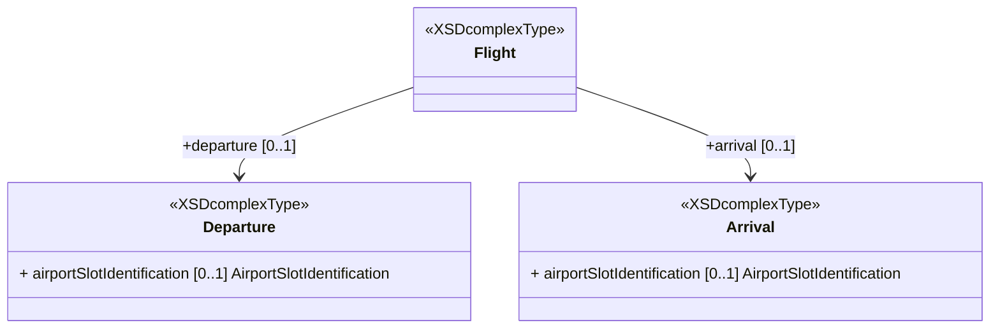

# Airport Slot Identification

Airport slots are being used to balance demand against available airport capacity at airports where the
demand exceeds this capacity. The process of allocating airport slots at
coordinated airports is based on the IATA Worldwide Slot Guidelines as a globally accepted standard.

Some countries require that an airport slot reference is obtained and reflected in the flight plan 
for non-scheduled air transport operations or general aviation. The airport slot reference is defined as 
*the identifier of the scheduled time of arrival or departure available for allocation by, 
or as allocated by, a coordinator for an aircraft movement on a specific date at a coordinated airport*. 

## FIXM Representation

The FIXM Core classes `Departure` and `Arrival` both have a property `airportSlotIdentification` that can be used for exchanging a departure or arrival airport slot reference. 



This airport slot reference is expressed as a CharacterString with a maxLength set to 10. This is based on the recommendation of the taskforce of experts from 
the European Airport Coordinators Association (EUACA), the International Air Transport Association (IATA) and EUROCONTROL 
which was set-up in order to discuss solutions for integrating airport slot information into FF-ICE information.

## Examples

Identification of a departure airport slot allocated to a General Aviation/Business Aviation (from [ATMRPP-WG/28-WP/653](https://eurocontrol.sharepoint.com/:b:/r/sites/coll-FIXM/Shared%20Documents/FIXM%20Change%20Requests/ICAO%20ATMRPP%20inputs%20for%20FIXM/WP653%20SLOT%20in%20FF-ICE.pdf?csf=1&web=1&e=JBfNqO))
```xml
<!--xmlns:fx="http://www.fixm.aero/flight/4.3"-->
<fx:flight>
  <fx:departure>
    <fx:airportSlotIdentification>1407011234</fx:airportSlotIdentification>    
```

Identification of a departure airport slot allocated in Europe (from [EUROCONTROL IFPS User Manual R27](https://www.eurocontrol.int/publication/ifps-users-manual)).
```xml
<!--xmlns:fx="http://www.fixm.aero/flight/4.3"-->
<fx:flight>
  <fx:departure>
    <fx:airportSlotIdentification>QB7361</fx:airportSlotIdentification>    
```
