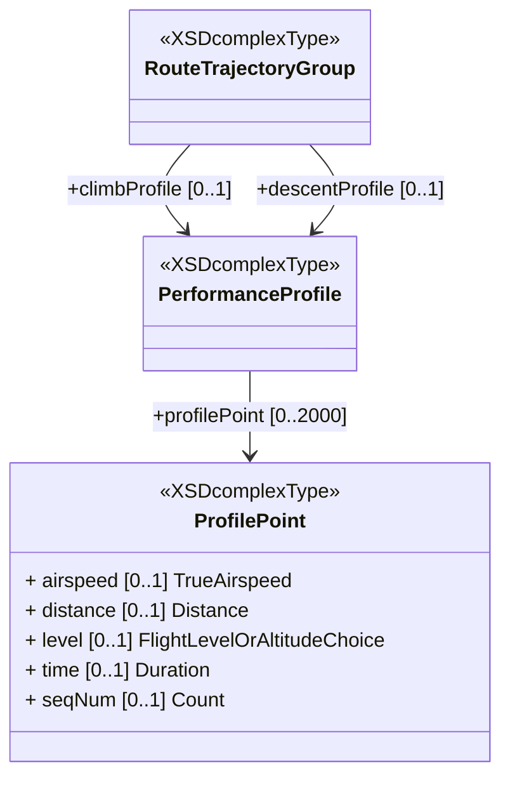

# Performance Profile

As explained in the FF-ICE/R1 Implementation Guidance Manual <sup>[[I-06]](#references)</sup>,
the `Performance Profile` is a zero-wind, standard atmosphere profile reflective of the flight capabilities and desired parameters. 
It does not include any flight-specific constraints such as altitude or speed restrictions applicable to the route of flight. 
However, it does incorporate constraints that are always applicable (e.g., a 250 knot constraint applicable to all flights below 10,000 feet), 
and gradients required for obstacle clearance along the route of flight.

A `Performance Profile` is expressed as a sequence of `Profile Points` each containing: distance, time duration, flight level or altitude, and optionally the true airspeed.

Climb profiles begin at take-off with distance and time expressed relative to the point associated with take-off, nominally the “Wheels Off” point. Climb profiles end at the maximum operational cruise altitude for the specific route/trajectory.

Descent profiles begin at a top-of-descent at the maximum operational cruise altitude for the specific route/trajectory. Time and distance are expressed relative to the top-of-descent. Descent profiles end at touchdown.

## FIXM Representation

The FIXM Core class `RouteTrajectoryGroup` has two properties `climbProfile` and `descentProfile` that can be used for exchanging the `Performance Profile`.



## Example of Climb Profile


```xml
<!--xmlns:fx="http://www.fixm.aero/flight/4.3"-->
<fx:climbProfile>
    <fx:profilePoint seqNum="0">
        <fx:distance uom="M">0.0</fx:distance>
        <fx:level>
            <fb:altitude uom="M">110.0</fb:altitude>
        </fx:level>
        <fx:time>P0DT0H0M0S</fx:time>
    </fx:profilePoint>
    <fx:profilePoint seqNum="1">
        <fx:distance uom="M">6939.0</fx:distance>
        <fx:level>
            <fb:altitude uom="M">610.0</fb:altitude>
        </fx:level>
        <fx:time>P0DT0H1M41S</fx:time>
    </fx:profilePoint>
    <fx:profilePoint seqNum="2">
        <fx:distance uom="M">9284.0</fx:distance>
        <fx:level>
            <fb:altitude uom="M">914.0</fb:altitude>
        </fx:level>
        <fx:time>P0DT0H1M59S</fx:time>
    </fx:profilePoint seqNum="3">
    <fx:profilePoint>
        <fx:distance uom="M">11726.0</fx:distance>
        <fx:level>
            <fb:altitude uom="M">1219.0</fb:altitude>
        </fx:level>
        <fx:time>P0DT0H2M17S</fx:time>
    </fx:profilePoint>
    <fx:profilePoint seqNum="4">
        <fx:distance uom="M">14243.0</fx:distance>
        <fx:level>
            <fb:altitude uom="M">1524.0</fb:altitude>
        </fx:level>
        <fx:time>P0DT0H2M35S</fx:time>
    </fx:profilePoint>
    <fx:profilePoint seqNum="5">
        <fx:distance uom="M">16852.0</fx:distance>
        <fx:level>
            <fb:altitude uom="M">1829.0</fb:altitude>
        </fx:level>
        <fx:time>P0DT0H2M54S</fx:time>
    </fx:profilePoint>
    <fx:profilePoint seqNum="6">
        <fx:distance uom="M">19535.0</fx:distance>
        <fx:level>
            <fb:altitude uom="M">2134.0</fb:altitude>
        </fx:level>
        <fx:time>P0DT0H3M14S</fx:time>
    </fx:profilePoint>
    <fx:profilePoint seqNum="7">
        <fx:distance uom="M">22329.0</fx:distance>
        <fx:level>
            <fb:altitude uom="M">2438.0</fb:altitude>
        </fx:level>
        <fx:time>P0DT0H3M33S</fx:time>
    </fx:profilePoint>
    <fx:profilePoint seqNum="8">
        <fx:distance uom="M">25197.0</fx:distance>
        <fx:level>
            <fb:altitude uom="M">2743.0</fb:altitude>
        </fx:level>
        <fx:time>P0DT0H3M53S</fx:time>
    </fx:profilePoint>
    <fx:profilePoint seqNum="9">
        <fx:distance uom="M">28157.0</fx:distance>
        <fx:level>
            <fb:altitude uom="M">3048.0</fb:altitude>
        </fx:level>
        <fx:time>P0DT0H4M13S</fx:time>
    </fx:profilePoint>
    <fx:profilePoint seqNum="10">
        <fx:distance uom="M">36206.0</fx:distance>
        <fx:level>
            <fb:altitude uom="M">3353.0</fb:altitude>
        </fx:level>
        <fx:time>P0DT0H5M1S</fx:time>
    </fx:profilePoint>
    <fx:profilePoint seqNum="11">
        <fx:distance uom="M">39851.0</fx:distance>
        <fx:level>
            <fb:altitude uom="M">3658.0</fb:altitude>
        </fx:level>
        <fx:time>P0DT0H5M21S</fx:time>
    </fx:profilePoint>
    <fx:profilePoint seqNum="12">
        <fx:distance uom="M">43644.0</fx:distance>
        <fx:level>
            <fb:altitude uom="M">3962.0</fb:altitude>
        </fx:level>
        <fx:time>P0DT0H5M42S</fx:time>
    </fx:profilePoint>
    <fx:profilePoint seqNum="13">
        <fx:distance uom="M">47585.0</fx:distance>
        <fx:level>
            <fb:altitude uom="M">4267.0</fb:altitude>
        </fx:level>
        <fx:time>P0DT0H6M3S</fx:time>
    </fx:profilePoint>
    <fx:profilePoint seqNum="14">
        <fx:distance uom="M">51729.0</fx:distance>
        <fx:level>
            <fb:altitude uom="M">4572.0</fb:altitude>
        </fx:level>
        <fx:time>P0DT0H6M25S</fx:time>
    </fx:profilePoint>
    <fx:profilePoint seqNum="15">
        <fx:distance uom="M">55112.0</fx:distance>
        <fx:level>
            <fb:altitude uom="M">4810.0</fb:altitude>
        </fx:level>
        <fx:time>P0DT0H6M43S</fx:time>
    </fx:profilePoint>
    <fx:profilePoint seqNum="16">
        <fx:distance uom="M">60609.0</fx:distance>
        <fx:level>
            <fb:altitude uom="M">5182.0</fb:altitude>
        </fx:level>
        <fx:time>P0DT0H7M11S</fx:time>
    </fx:profilePoint>
    <fx:profilePoint seqNum="17">
        <fx:distance uom="M">65383.0</fx:distance>
        <fx:level>
            <fb:altitude uom="M">5486.0</fb:altitude>
        </fx:level>
        <fx:time>P0DT0H7M35S</fx:time>
    </fx:profilePoint>
    <fx:profilePoint seqNum="18">
        <fx:distance uom="M">70432.0</fx:distance>
        <fx:level>
            <fb:altitude uom="M">5791.0</fb:altitude>
        </fx:level>
        <fx:time>P0DT0H8M0S</fx:time>
    </fx:profilePoint>
    <fx:profilePoint seqNum="19">
        <fx:distance uom="M">75760.0</fx:distance>
        <fx:level>
            <fb:altitude uom="M">6096.0</fb:altitude>
        </fx:level>
        <fx:time>P0DT0H8M26S</fx:time>
    </fx:profilePoint>
    <fx:profilePoint seqNum="20">
        <fx:distance uom="M">81384.0</fx:distance>
        <fx:level>
            <fb:altitude uom="M">6401.0</fb:altitude>
        </fx:level>
        <fx:time>P0DT0H8M54S</fx:time>
    </fx:profilePoint>
    <fx:profilePoint seqNum="21">
        <fx:distance uom="M">87376.0</fx:distance>
        <fx:level>
            <fb:altitude uom="M">6706.0</fb:altitude>
        </fx:level>
        <fx:time>P0DT0H9M22S</fx:time>
    </fx:profilePoint>
    <fx:profilePoint seqNum="22">
        <fx:distance uom="M">90738.0</fx:distance>
        <fx:level>
            <fb:altitude uom="M">6867.0</fb:altitude>
        </fx:level>
        <fx:time>P0DT0H9M37S</fx:time>
    </fx:profilePoint>
    <fx:profilePoint seqNum="23">
        <fx:distance uom="M">93721.0</fx:distance>
        <fx:level>
            <fb:altitude uom="M">7010.0</fb:altitude>
        </fx:level>
        <fx:time>P0DT0H9M52S</fx:time>
    </fx:profilePoint>
    <fx:profilePoint seqNum="24">
        <fx:distance uom="M">100490.0</fx:distance>
        <fx:level>
            <fb:altitude uom="M">7315.0</fb:altitude>
        </fx:level>
        <fx:time>P0DT0H10M23S</fx:time>
    </fx:profilePoint>
    <fx:profilePoint seqNum="25">
        <fx:distance uom="M">107702.0</fx:distance>
        <fx:level>
            <fb:altitude uom="M">7620.0</fb:altitude>
        </fx:level>
        <fx:time>P0DT0H10M55S</fx:time>
    </fx:profilePoint>
    <fx:profilePoint seqNum="26">
        <fx:distance uom="M">111586.0</fx:distance>
        <fx:level>
            <fb:altitude uom="M">7775.0</fb:altitude>
        </fx:level>
        <fx:time>P0DT0H11M13S</fx:time>
    </fx:profilePoint>
    <fx:profilePoint seqNum="27">
        <fx:distance uom="M">115358.0</fx:distance>
        <fx:level>
            <fb:altitude uom="M">7925.0</fb:altitude>
        </fx:level>
        <fx:time>P0DT0H11M29S</fx:time>
    </fx:profilePoint>
    <fx:profilePoint seqNum="28">
        <fx:distance uom="M">123477.0</fx:distance>
        <fx:level>
            <fb:altitude uom="M">8230.0</fb:altitude>
        </fx:level>
        <fx:time>P0DT0H12M5S</fx:time>
    </fx:profilePoint>
    <fx:profilePoint seqNum="29">
        <fx:distance uom="M">132130.0</fx:distance>
        <fx:level>
            <fb:altitude uom="M">8534.0</fb:altitude>
        </fx:level>
        <fx:time>P0DT0H12M43S</fx:time>
    </fx:profilePoint>
    <fx:profilePoint seqNum="30">
        <fx:distance uom="M">141392.0</fx:distance>
        <fx:level>
            <fb:altitude uom="M">8839.0</fb:altitude>
        </fx:level>
        <fx:time>P0DT0H13M22S</fx:time>
    </fx:profilePoint>
    <fx:profilePoint seqNum="31">
        <fx:distance uom="M">151320.0</fx:distance>
        <fx:level>
            <fb:altitude uom="M">9144.0</fb:altitude>
        </fx:level>
        <fx:time>P0DT0H14M4S</fx:time>
    </fx:profilePoint>
    <fx:profilePoint seqNum="32">
        <fx:distance uom="M">162188.0</fx:distance>
        <fx:level>
            <fb:altitude uom="M">9449.0</fb:altitude>
        </fx:level>
        <fx:time>P0DT0H14M49S</fx:time>
    </fx:profilePoint>
    <fx:profilePoint seqNum="33">
        <fx:distance uom="M">174349.0</fx:distance>
        <fx:level>
            <fb:altitude uom="M">9754.0</fb:altitude>
        </fx:level>
        <fx:time>P0DT0H15M39S</fx:time>
    </fx:profilePoint>
</fx:climbProfile>
```

## Example of Descent Profile


```xml
<fx:descentProfile>			
	<fx:profilePoint>		
		<fx:distance uom="M">236300.0</fx:distance>	
		<fx:level>	
			<fb:altitude uom="M">11887.0</fb:altitude>
		</fx:level>	
		<fx:time>P0DT0H0M0S</fx:time>	
	</fx:profilePoint>		
	<fx:profilePoint>		
		<fx:distance uom="M">197590.0</fx:distance>	
		<fx:level>	
			<fb:altitude uom="M">10404.0</fb:altitude>
		</fx:level>	
		<fx:time>P0DT0H2M51S</fx:time>	
	</fx:profilePoint>		
	<fx:profilePoint>		
		<fx:distance uom="M">166603.0</fx:distance>	
		<fx:level>	
			<fb:altitude uom="M">8691.0</fb:altitude>
		</fx:level>	
		<fx:time>P0DT0H5M20S</fx:time>	
	</fx:profilePoint>		
	<fx:profilePoint>		
		<fx:distance uom="M">157342.0</fx:distance>	
		<fx:level>	
			<fb:altitude uom="M">8157.0</fb:altitude>
		</fx:level>	
		<fx:time>P0DT0H6M7S</fx:time>	
	</fx:profilePoint>		
	<fx:profilePoint>		
		<fx:distance uom="M">135395.0</fx:distance>	
		<fx:level>	
			<fb:altitude uom="M">6889.0</fb:altitude>
		</fx:level>	
		<fx:time>P0DT0H8M3S</fx:time>	
	</fx:profilePoint>		
	<fx:profilePoint>		
		<fx:distance uom="M">126136.0</fx:distance>	
		<fx:level>	
			<fb:altitude uom="M">6373.0</fb:altitude>
		</fx:level>	
		<fx:time>P0DT0H8M54S</fx:time>	
	</fx:profilePoint>		
	<fx:profilePoint>		
		<fx:distance uom="M">103893.0</fx:distance>	
		<fx:level>	
			<fb:altitude uom="M">5179.0</fb:altitude>
		</fx:level>	
		<fx:time>P0DT0H11M2S</fx:time>	
	</fx:profilePoint>		
	<fx:profilePoint>		
		<fx:distance uom="M">85404.0</fx:distance>	
		<fx:level>	
			<fb:altitude uom="M">4220.0</fb:altitude>
		</fx:level>	
		<fx:time>P0DT0H12M56S</fx:time>	
	</fx:profilePoint>		
	<fx:profilePoint>		
		<fx:distance uom="M">66881.0</fx:distance>	
		<fx:level>	
			<fb:altitude uom="M">3223.0</fb:altitude>
		</fx:level>	
		<fx:time>P0DT0H14M55S</fx:time>	
	</fx:profilePoint>		
	<fx:profilePoint>		
		<fx:distance uom="M">58009.0</fx:distance>	
		<fx:level>	
			<fb:altitude uom="M">2733.0</fb:altitude>
		</fx:level>	
		<fx:time>P0DT0H15M55S</fx:time>	
	</fx:profilePoint>		
	<fx:profilePoint>		
		<fx:distance uom="M">36961.0</fx:distance>	
		<fx:level>	
			<fb:altitude uom="M">1355.0</fb:altitude>
		</fx:level>	
		<fx:time>P0DT0H18M24S</fx:time>	
	</fx:profilePoint>		
	<fx:profilePoint>		
		<fx:distance uom="M">27814.0</fx:distance>	
		<fx:level>	
			<fb:altitude uom="M">1129.0</fb:altitude>
		</fx:level>	
		<fx:time>P0DT0H20M17S</fx:time>	
	</fx:profilePoint>		
	<fx:profilePoint>		
		<fx:distance uom="M">0.0</fx:distance>	
		<fx:level>	
			<fb:altitude uom="M">441.0</fb:altitude>
		</fx:level>	
		<fx:time>P0DT0H25M58S</fx:time>	
	</fx:profilePoint>		
</fx:descentProfile>		
```

## References

### ICAO References

[I-06]: [ICAO Doc 9965, 2nd Edition, Volume II, v0.993 (DRAFT)](https://portal.icao.int/atmrpp/ATMRPP5%20Montreal%2059%20June%202023/1_Working%20papers/ATMRPP5_WP1000_Appendix%20C%20Doc%209965%20Vol%20II%20Implementation%20Guidance%20d0.993_markup.pdf) - Manual on FF-ICE, FF-ICE/R1 Implementation Guidance Manual **DRAFT** 
